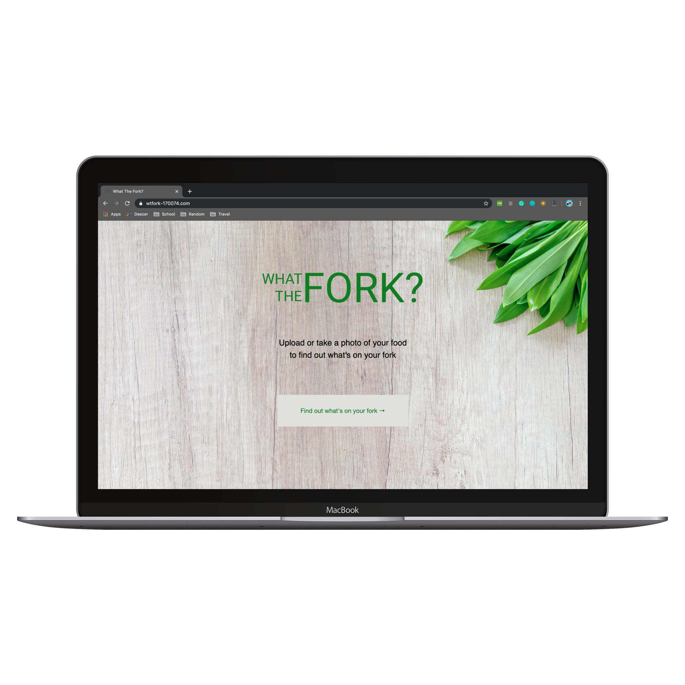

# [What the Fork?]

What the fork is an AI powered web application.
It is used to give users a better idea of the nutritional value of their food!


### Features!

  - The interface consists of a Homepage, Food Analysis Page, and Information Page
  - Users can either take a picture with their camera, or load a picture from their gallery
  - The picture is then analysed with Clarifai's Food Model
  - Once Clarifai tells us what we're eating, we send the name to Wolfram
  - Wolfram then analyses the food, and returns the nutritional information
  - If users do not understand something on the analysis, they can navigate to the information page to get a definition




### Built with

What the Fork uses the following dependencies:

* [ReactJS] - A JS library for building interfaces!
* [Clarifai] - A computer vision AI API!
* [Wolfram] - A food nutrition API


### Installation

Install the dependencies and start the server.

```sh
$ cd WTFork
$ yarn
$ yarn start
```

#### Building What the Fork for source

```sh
$ yarn build
```

Opeen the site in the server address in your browser.

```sh
127.0.0.1:8000
```

License
----

MIT

   [What the Fork?]: <https://www.wtfork-170074.com>
   [Reactjs]: <http://reactjs.org>
   [Clarifai]: <https://www.clarifai.com>
   [Wolfram]: <https://www.wolframalpha.com/examples/society-and-culture/food-and-nutrition/>

